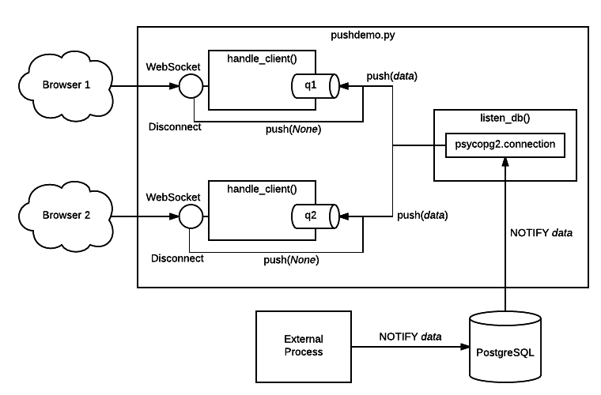

=========================================
*Psycopg*: bridging PostgreSQL and Python
=========================================

.. image:: img/psycopg.png

.. class:: text-right

    Brighton PostgreSQL Meetup, ``'2016-10-14'::date``

    Daniele Varrazzo

..
    Note to piro: you want
    :autocmd BufWritePost psycopg.rst :silent !make html

----

Assumptions
===========

* You know some Python
* You know some PostgreSQL
* You want to do something with the two

----

Basic usage
===========

The roles of the main actors

.. code-block:: python

    import psycopg2                             # the driver
    conn = psycopg2.connect("dbname=piro")      # the connection/session
    cur = conn.cursor()                         # the cursor - holds a result

    cur.execute("select 10 as a, 'foo' as b")   # sends command
    cur.fetchone()                              # retrieve results
    conn.commit()                               # controls the session

Different ways to consume data

.. code-block:: python

    cur.fetchone()      # returns one tuples
    cur.fetchmany(n)    # returns a list of n tuples
    cur.fetchall()      # returns a list with all the tuples
    for t in cur:
        pass            # iterable of tuples

----

Returning data
==============

.. code-block:: python

    # Normal cursor, returning tuple, separate description
    In [5]: cur.execute("select 10 as a, 'foo' as b")
    In [6]: cur.fetchone()
    Out[6]: (10, 'foo')

    In [7]: cur.description
    Out[7]:
    (Column(name='a', type_code=23, display_size=None, internal_size=4,
            precision=None, scale=None, null_ok=None),
     Column(name='b', type_code=705, display_size=None, internal_size=-2,
            precision=None, scale=None, null_ok=None))

    # Other subclasses: a cursor returning a dict
    In [8]: import psycopg2.extras
    In [9]: cur = conn.cursor(cursor_factory=psycopg2.extras.RealDictCursor)
    In [10]: cur.execute("select 10 as a, 'foo' as b")
    In [11]: cur.fetchone()
    Out[11]: {'a': 10, 'b': 'foo'}

    # ...or a named tuple
    In [12]: cur = conn.cursor(cursor_factory=psycopg2.extras.NamedTupleCursor)
    In [13]: cur.execute("select 10 as a, 'foo' as b")
    In [14]: cur.fetchone()
    Out[14]: Record(a=10, b='foo')

----

Data type mapping
=================

Default data types mapping: no surprise here

.. table::
    :class: data-types

    +--------------------+-------------------------+
    | Python             | PostgreSQL              |
    +====================+=========================+
    | ``None``           | ``NULL``                |
    +--------------------+-------------------------+
    | ``bool``           | ``bool``                |
    +--------------------+-------------------------+
    | ``int``,           | ``smallint``,           |
    | ``long``           | ``integer``,            |
    |                    | ``bigint``              |
    +--------------------+-------------------------+
    | ``float``          | ``real``,               |
    |                    | ``double``              |
    +--------------------+-------------------------+
    | ``Decimal``        | ``numeric``             |
    +--------------------+-------------------------+
    | ``str``,           | ``varchar``,            |
    | ``unicode``        | ``text``                |
    +--------------------+-------------------------+
    | ``date``           | ``date``                |
    +--------------------+-------------------------+
    | ``time``           | ``time``                |
    +--------------------+-------------------------+
    | ``datetime``       | ``timestamp``,          |
    |                    | ``timestamptz``         |
    +--------------------+-------------------------+
    | ``timedelta``      | ``interval``            |
    +--------------------+-------------------------+

----

More Data!
==========

- ``list`` <-> ``ARRAY``

  .. code-block:: python

    >>> cur.execute("""select array_agg(d)::date[]
        from generate_series('2013-07-11'::date, '2013-07-12'::date,
            '1 day'::interval) s(d)""")
    # [datetime.date(2013, 7, 11), datetime.date(2013, 7, 12)]

- [``named``] ``tuple`` <-> composite

  .. code-block:: python

    >>> cur.execute("CREATE TYPE card AS (value int, suit text)")
    >>> psycopg2.extras.register_composite('card', cur)
    >>> cur.execute("select (8, 'hearts')::card")
    # card(value=8, suit='hearts')

- ``dict`` of ``str`` <-> ``hstore``

  .. code-block:: python

    >>> psycopg2.extras.register_hstore(cur)
    >>> cur.execute("select 'a => foo, b => NULL'::hstore")
    # {'a': 'foo', 'b': None}

----

Even More Data!
===============

- Psycopg's ``Range`` <-> ``range``

  .. code-block:: python

    >>> cur.execute("select '[0,10)'::int8range")
    # NumericRange(0, 10, '[)')
    >>> r.upper_inc, r.lower_inc
    (False, True)

  - Builtin range types supported out-of-the-box
  - New range type supported by ``psycopg2.extras.register_range()``

- Anything™ <-> ``json``, ``jsonb``

  .. code-block:: python

    >>> cur.execute("insert into mytable (jsondata) values (%s)",
        [Json({'a': 100})])

----

Typecasting
===========

.. image:: img/pg-to-py.png

Typecasters have:

- one or more OID
- a name
- a conversion function

----

Typecasting
===========

.. image:: img/pg-to-py.png

Customizing a typecaster

.. code-block:: pycon

    >>> cur.execute("select 123.45")
    >>> cur.fetchone()
    (Decimal('123.45'),)

    >>> from psycopg2 import extensions as ext

    >>> def num2float(s, cur):
    ...     if s is None:
    ...         return float(s)

    >>> t = ext.new_type((1700,), "NUM2FLOAT", num2float)
    >>> ext.register_type(t, cur)

    >>> cur.execute("select 123.45")
    >>> cur.fetchone()
    (123.45,)

----

Typecasting
===========

.. image:: img/pg-to-py.png

Easy array typecaster

.. code-block:: pycon

    >>> cur.execute("select '{1,2,3,4,5}'::numeric[]")
    >>> cur.fetchone()
    ([Decimal('1'), Decimal('2'), Decimal('3'), Decimal('4'), Decimal('5')],)

    >>> ta = ext.new_array_type((1231,), 'NUM2FLOAT[]', t)
    >>> ext.register_type(ta, cur)

    >>> cur.execute("select '{1,2,3,4,5}'::numeric[]")
    >>> cur.fetchone()
    ([1.0, 2.0, 3.0, 4.0, 5.0],)

----

Adaptation
==========

.. image:: img/py-to-pg.png

.. code-block:: pycon

    >>> cur.execute("select '%s' || '%s'" % ('a', 'b'))
    >>> cur.fetchone()
    ('ab',)

    >>> cur.execute("select '%s' || '%s'" % ("O'Reilly", ' Books'))
    Traceback (most recent call last):
      File "<ipython-input-29-720a7746fc83>", line 1, in <module>
        cur.execute("select '%s' || '%s'" % ("O'Reilly", ' Books'))
    ProgrammingError: syntax error at or near "' || '"
    LINE 1: select 'O'Reilly' || ' Books'
                            ^

    >>> cur.execute("select %s || %s", ("O'Reilly", ' Books'))
    >>> cur.fetchone()
    ("O'Reilly Books",)

----

Adaptation
==========

.. code-block:: pycon

    >>> cur.execute("insert into students (name) values ('%s')" % name)

.. image:: img/exploits_of_a_mom.png

Funny, but wrong conclusion:

.. code-block:: pycon

    >>> cur.execute("insert into students (name) values (%s)" , [name])

Look ma: no *saniti(s|z)ing database input* here!

----

CustomiZZing Adaptation
=======================

.. image:: img/py-to-pg.png

- Based on Python class

- Using adapter function

.. code-block:: pycon

    >>> class Mac(object):
    ...     def __init__(self, *args):
    ...         if len(args) != 6:
    ...             raise ValueError('need 6 args')
    ...         self.args = args
    ...
    ...     def __str__(self):
    ...         return ':'.join(map(str, self.args))

    >>> print Mac(10,20,30,40,50,60)
    10:20:30:40:50:60

----

CustomiXing adaptation
======================

.. image:: img/py-to-pg.png

- Based on Python class

- Using adapter function

.. code-block:: pycon

    >>> class MacAdapter(object):
    ...     def __init__(self, obj):
    ...         self.obj = obj
    ...     def getquoted(self):
    ...         return "'%s'::macaddr" % str(self.obj)

    >>> ext.register_adapter(Mac, MacAdapter)

    >>> m = Mac(10,20,30,40,50,60)
    >>> cur.execute("insert into macs (mac) values (%s)", [m])

----

The other side too
==================

.. image:: img/pg-to-py.png

.. code-block:: pycon

    >>> def cast_mac(s, cur):
    ...     if s is not None:
    ...         return Mac(*s.split(':'))

    >>> MAC = ext.new_type((829,), 'MAC', cast_mac)
    >>> ext.register_type(MAC, cur)

    >>> cur.execute("select * from macs")
    >>> print cur.fetchone()[1]
    10:20:30:40:50:60

----

``pushdemo.py`` architecture
============================

----

Async notification demo
=======================

Using gevent__, gevent-websocket__, psycogreen__

.. __: http://www.gevent.org/
.. __: http://www.gelens.org/code/gevent-websocket/
.. __: https://bitbucket.org/dvarrazzo/psycogreen/

.. class:: apology

    This demo requires the ``pushdemo.py`` script running.

.. raw:: html

    
    
    
    
&nbsp;

    
&nbsp;

    
&nbsp;

    

.. class:: text-right

    Demo code at https://github.com/dvarrazzo/psycopg-brighton-2016

----

Async notification demo (offline)
=================================

.. image:: img/pushdemo.png
